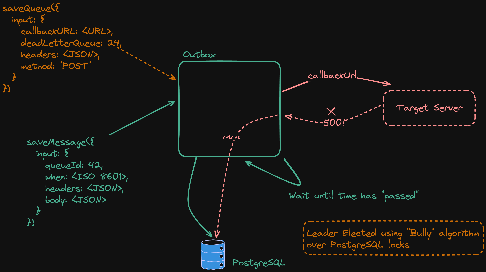

# @platformatic/pg-hooks

Implement web hooks inside your application easily.
Features:

1. delayed/scheduled invocation
2. automatic retries
3. leader/follower system (with election)
4. dead letter queue
5. cron

`@platformatic/pg-hooks` is also useful to create an outbox.



## API Tutorial

To verify everything is working correctly, we will do a short tutorial

### Create a target service

Create a new Platformatic application with the Kafka hooks package using [Wattpm](https://platformatic.io/docs/wattpm):

```bash
npx wattpm@latest create
```

And select `@platformatic/service` from the list of available packages and name your application `target`.


Now, create a `services/target/routes/hook.js` file with the following content:

```js
export async function (fastify, opts) {
  fastify.post('/receive-my-hook', async (request, reply) => {
    request.log.info({ body: request.body }, 'Received hook')
    return 'ok'
  })
}
```

Then, edit the `.env` file so that `PORT=3001`

Run `wattpm start` to start your app. To verify that your applications is working as expected, in another shell run:

```bash
curl -X POST -H 'Content-Type: application/json' -d '{ "hello": "world" }' http://127.0.0.1:3001/receive-my-hook
```

This will print `ok` and log the received body in the console.

### Create a Queue

Create a queue with

```bash
curl --request POST \
  --url http://127.0.0.1:3042/queues/ \
  --header 'Content-Type: application/json' \
  --data '{
  "name": "my test",
  "callbackUrl": "http://127.0.0.1:3001/receive-my-hook",
  "method": "POST",
  "headers": {
    "Content-Type": "application/json"
  },
  "maxRetries": 1
}'
```

or via OpenAPI or GraphQL web pages.

### Create a Message

```bash
curl --request POST \
  --url http://0.0.0.0:3042/messages/ \
  --header 'Content-Type: application/json' \
  --data '{
  "queueId": 1,
  "body": "{ \"hello\": \"world\" }"
}'
```

Watch the logs in both the service and the hooks app.

### Create a Cron (optional)

You can set up a cron job with:

```bash
curl --request POST \
  --url http://0.0.0.0:3042/cron/ \
  --header 'Content-Type: application/json' \
  --data '{
  "queueId": 2,
  "schedule": "* * * * *",
  "body": "{ \"hello\": \"world\" }"
}'
```

If you need a refresher on the CRON syntax, check out [crontab.guru](https://crontab.guru).

## Authorization

`@platformatic/pg-hooks` is built around [`@platformatic/db`](https://docs.platformatic.dev/docs/reference/db/overview),
which means that authorization can be set up with its [strategies](https://docs.platformatic.dev/docs/reference/db/authorization/strategies).

The following will configure `@platformatic/pg-hooks` to only accept schedule requests by an admin that knowns the
`PLT_ADMIN_SECRET` env variable:

```json
{
 ...
 "authorization": {
    "adminSecret": "{PLT_ADMIN_SECRET}",
    "rules": [
      {
        "role": "anonymous",
        "entity": "queue",
        "find": false,
        "save": false,
        "delete": false
      },
      {
        "role": "anonymous",
        "entity": "cron",
        "find": false,
        "save": false,
        "delete": false
      },
      {
        "role": "anonymous",
        "entity": "message",
        "find": false,
        "save": false,
        "delete": false
      }
    ]
  },
  ...
}
```

For every http request, a `X-PLATFORMATIC-ADMIN-SECRET` header must be set with the same content of `PLT_ADMIN_SECRET`.

## Leader election

`@platformatic/pg-hooks` elects a Leader using a [PostgreSQL Advisory Locks](https://www.postgresql.org/docs/current/explicit-locking.html#ADVISORY-LOCKS),
with a first-comes-win election: the first process that can grab the lock is the leader.

Currently, the leader is responsible for cron scheduling and message delivery, with all the peer responsible for
creating queues and storing messages in the database.

## License

Apache-2.0
